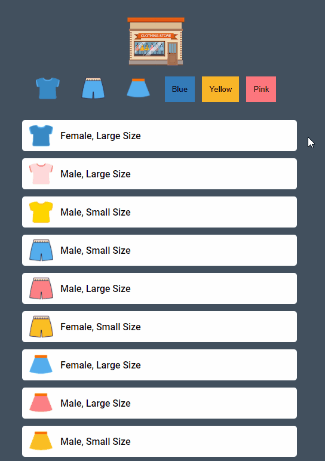

# Mini Shopping

## 프로젝트 안내 자료

[[자바스크립트를 이용한 미니 게임 만들기 프로젝트 안내편]](https://www.youtube.com/watch?v=We2Kv1HMGvc&list=PLv2d7VI9OotTVOL4QmPfvJWPJvkmv6h-2&index=22)

## 강의를 볼 때 주의사항

1. 강의를 보면서 따라만들면 내 것이 안된다.

2. 강의를 보기 전에 화면만 보고 한번 만들어보고 잘 안되면 강의를 먼저 보고난 후에 강의를 생각하며 만든다.

3. 부족한 부분 있다면 다시 강의를 보고난 후 생각하며 다시 처음부터 만든다.

4. 강의를 많이 보는 것보다 중요한 것은 하나를 보더라도 내 것이 되는가이다.

## 결과물



## 코딩 과정

### 1. 화면만 보고 코딩 (제한시간 : 2시간)

```
[문제]

- 하나의 버튼을 선택하고 다른 버튼을 누를 시 클래스 이름이 중첩처리된다.
    - 셔츠 버튼을 누르고 바지 버튼을 누를 시 바지 아이템이 보이지 않는 문제 발생.

- 데이터의 처리 방식이 하드 코딩으로 작성되어 있다.
    - 데이터가 유동적으로 움직일 수 없다.
    - 데이터 변경 시 많은 시간이 소요된다.

- 코드가 전체적으로 정리되어 있지 않다.
```
